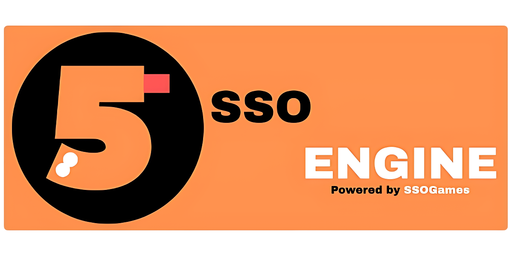

<p align="center">
  
</p>

# SSOEngine 1.7

**Cross-platform 2D game engine SDK built on Raylib**

> Focused on Windows desktop and Android mobile from a single codebase.

---

## What SSOEngine 1.7 Actually Is

SSOEngine is a lightweight C++ engine wrapper for Raylib that provides a practical toolkit for 2D games, asset bundling, and cross-platform deployment.

- ✅ Virtual resolution rendering with automatic letterboxing
- ✅ Binary asset bundles for textures, fonts, audio, JSON, and optional models
- ✅ Automatic music management and simplified audio playback
- ✅ Smooth camera follow and screen shake helpers
- ✅ Advanced text rendering and UI styling utilities
- ✅ Persistent save system with cross-platform paths
- ✅ Build automation for Windows and Android
- ✅ New 2D physics system with `sso_physics.h` for grounded movement and fast collision detection
- ✅ Optional 3D physics helper for experimental cases

## Core engine tools in v1.7

- `sso_window.h` — virtual resolution display, scaled rendering, border support.
- `sso_camera.h` — smooth 2D camera follow, zoom, and shake.
- `sso_ui.h` — styled buttons, panels, shadows, glows, and color helpers.
- `sso_audio.h` — sound/music loading and managed music streaming.
- `sso_provider.h` — `.sso` asset bundle loading and JSON support.
- `sso_text.h` — typewriter text, outlines, gradients, hyperlinks.
- `sso_timer.h` — delta time, stopwatch, countdown.
- `sso_memo.h` — persistent key/value storage and save files.
- `sso_physics.h` — 2D physics world helper with grounded movement and collision.
- `sso_ext.h` — system utilities, file operations, environment helpers.
- `sso_splash.h` — startup splash screen helper.
- `sso_logger.h` — timestamped console logging.
- `sso_math.h` — collision and utility math helpers.
- `sso_file.h` — file dialog declarations.
- `sso_ph3d.h` — optional advanced 3D physics helper.


## EXAMPLE GAMES


## Engine focus

SSOEngine 1.7 is primarily a **2D game engine**. The included `sso_ph3d.h` helper is optional and intended for experimental 3D physics support only.

## Quick start example

```cpp
#include "tools/sso_window.h"
#include "tools/sso_camera.h"
#include "tools/sso_audio.h"
#include "tools/sso_timer.h"

int main() {
    SSO::Window::Init(1280, 720, "SSOEngine 1.7");
    SSO::Camera camera({640, 360});
    SSO::Timer timer;

    Music bgm = SSO::Audio::LoadMusicStream("assets/music.mp3");
    SSO::Audio::RegisterMusic(bgm);
    SSO::Audio::PlayMusic(bgm);

    while (!WindowShouldClose()) {
        float dt = timer.GetDeltaTime();
        camera.Follow({640, 360}, dt);

        SSO::Audio::UpdateAudio();

        SSO::Window::BeginDrawingVirtual();
        ClearBackground(RAYWHITE);

        camera.Begin();
        // Draw your game world here
        camera.End();

        SSO::Window::EndDrawingVirtual();
    }

    SSO::Audio::ClearMusicManager();
    SSO::Window::Close();
    return 0;
}
```

## Asset bundling with `.sso`

SSOEngine uses a custom `.sso` asset bundle format for protected distribution and simplified asset loading.

### Supported bundle functions

- `SSO::Provider::LoadTextureFromBundle()`
- `SSO::Provider::LoadFontFromBundle()`
- `SSO::Provider::LoadWaveFromBundle()`
- `SSO::Provider::LoadMusicFromBundle()`
- `SSO::Provider::LoadJSONFromBundle()`
- `SSO::Provider::LoadModelFromBundle()`
- `SSO::Provider::LoadRawDataFromBundle()`
- `SSO::Provider::LoadVideoDataFromBundle()`

### Example

```cpp
#include "tools/sso_provider.h"

Texture2D player = SSO::Provider::LoadTextureFromBundle("assets.sso", "player.png");
Font font = SSO::Provider::LoadFontFromBundle("assets.sso", "font/JetBrainsMono-Bold.ttf", 24);

nlohmann::json config = SSO::Provider::LoadJSONFromBundle("assets.sso", "config.json");
if (!config.is_discarded()) {
    int speed = config["player"]["speed"].get<int>();
}
```

> Note: `LoadModelFromBundle()` is available, but `LoadMeshFromBundle()`, `LoadMaterialFromBundle()`, and `LoadAnimationFromBundle()` are not supported yet.

## Advanced text and UI

SSOEngine 1.7 improves text rendering with:

- `DrawShadow()`
- `DrawCentered()`
- `DrawCodeBlock()`
- `DrawTypewriter()`
- `DrawWrapped()`
- `DrawOutline()`
- `DrawVertical()`
- `DrawGradient()`
- `DrawHyperlink()`

The UI helper provides polished controls, including clickable buttons and panel layouts with shadow and glow effects.

## Persistent saves

`SSO::Memo` provides simple cross-platform save storage using key/value pairs and `.sml` files under `Documents/SSOEngine` by default.

## Build notes

- Run `build.bat` from `01_Core/` to build Windows or Android targets.
- `00_BuildTools/sso_packer.cpp` is the asset packer source for generating `.sso` bundles.

## Actual v1.7 highlights

- `SSO::Window` virtual resolution manager with scaled rendering.
- `SSO::Provider::LoadJSONFromBundle()` for packaged configuration files.
- `SSO::Audio` managed music streams with `SSO::Audio::UpdateAudio()`.
- `SSO::UI` styled controls, shadows, glows, and hex color conversion.
- `SSO::Text` advanced rendering helpers and clickable hyperlinks.
- `SSO::Timer` countdown and stopwatch logic.
- `SSO::Memo` persistent save storage.
- Focused 2D engine flow with optional experimental 3D physics.
'